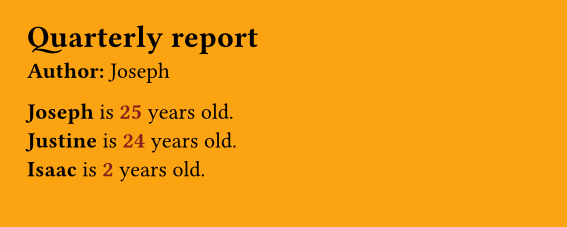
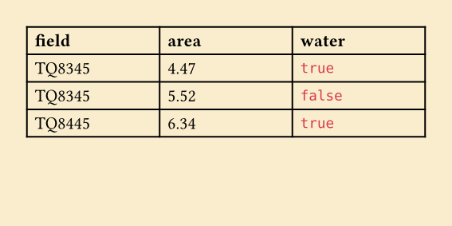

# tynding: Typst bindings for R


`tynding` is an R package that compiles Typst documents from R through a Rust backend.

- it exposes a small API for <u>writing</u>, _evaluating_ and **compiling** Typst files
- it lets you specify:
  - output format (pdf, png, svg, html)
  - font path to look for font files
  - pdf standard (for accessibility)
  - root path for more complex repos
  - _any other kind of inputs_, for advanced templating

<br>

## Installation

From R-universe (recommended):

```r
install.packages("tynding", repos = c("https://y-sunflower.r-universe.dev"))
```

> [!NOTE]
> `tynding` uses Typst 0.14.2, and the plan is to keep it as close as possible to the latest upstream version.

Or development version from GitHub (the package builds Rust code during installation, so you need):

- `R >= 4.2`
- `rustc >= 1.89.0` (see [installation](https://rust-lang.org/tools/install/))
- (Windows users only) GNU toolchain: run `rustup target add x86_64-pc-windows-gnu`

Then:

```r
#install.packages("pak")
pak::pak("y-sunflower/tynding")
```

<br>

## Quick start

```r
library(tynding)

markup <- c(
  '#set document(title: "hello from tynding")',
  "= hello world",
  "this document was compiled from R."
)

typ_file <- typst_write(markup)
pdf_file <- typst_compile(typ_file)

pdf_file
```

`typst_write()` writes a character vector to a `.typ` file. `typst_compile()` compiles that file and returns the output path. If you do not pass `output`, the result is written next to the source file using the extension implied by the output format. If no output format can be inferred, PDF is used by default.

<br>

## Features

- fonts: pass `font_path` to load font files from a directory before compiling.

```r
library(tynding)

markup <- c(
  '#set document(title: "custom font example")',
  '#set text(font: "Ultra")',
  '= hello world'
)

typ_file <- typst_write(markup)
pdf_file <- typst_compile(typ_file, font_path = "path/to/fonts")
```

- pdf standard: pass `pdf_standard` to request a Typst PDF profile such as `"1.7"`, `"2.0"`, `"a-2b"`, or `"ua-1"`.

```r
markup <- c(
  '#set document(title: "accessible PDF")',
  "= hello world"
)

typ_file <- typst_write(markup)
pdf_file <- typst_compile(typ_file, pdf_standard = "ua-1")
```

For `ua-1`, your document needs a title. Unsupported or invalid standards raise an error.

- output format: pass `output_format` to export as `"pdf"`, `"html"`, `"png"`, or `"svg"`. If you omit it, `tynding` will infer the format from the `output` extension when possible and otherwise default to PDF.

```r
library(tynding)

markup <- c(
  '#set document(title: "hello from tynding")',
  "= hello world",
  "this document was compiled from R."
)

typ_file <- typst_write(markup)
png_file <- typst_compile(typ_file, output_format = "png")
```

Multi-page `png` and `svg` exports with multiple pages will create multiple files. In order to [behaves the same as the Typst CLI](https://typst.app/docs/reference/png/#exporting-as-png), you'll need to pass an output file name as a template string. For example:

```r
library(tynding)

markup <- c(
  "this document was compiled from R.",
  "#pagebreak()"
)

typ_file <- typst_write(markup)
png_file <- typst_compile(typ_file, output_format = "png", output = "output-{p}.png")
```

This will create `output-1.png` and `output-2.png`.

- `root`: by default, the root path corresponds to the parent directory of `file` (detected automatically), but you can use the `root` argument to specify a different path, which is often useful in more complex projects where, for example, font files are located in a parent directory.

```r
library(tynding)

typst_compile(
  "reports/typst/document.typ",
  root = "reports",
  font_path = "reports/fonts"
)
```

This will let you organize your project as follow, which isn't possible by default:

```
root/
├── typst/
│   └── document.typ
└── fonts/
    ├── MyFont.tff
    └── MyFont-Bold.tff
```

<br>

## Advanced usage with inputs

You can send inputs thanks to Typst sys inputs handling. Basically, you do your things with R, and then send whatever you want to Typst! For example:

```r
library(tynding)

typst_compile(
  "file.typ",
  title = "Quarterly report",
  author = "Joseph",
  persons = list(
    list(name = "Joseph", age = 25),
    list(name = "Justine", age = 24),
    list(name = "Isaac", age = 2)
  )
)
```

Then your `file.typ` looks like this:

```typ
#set page(width: 10cm, height: 4cm, fill: rgb("#fca311"))

#let title = sys.inputs.at("title")
#let author = sys.inputs.at("author")
#let persons = json.decode(sys.inputs.at("persons"))

= #title
*Author:* #author

#for person in persons [
  #strong(person.name) is #text(fill: red.darken(50%), weight: "bold", [#person.age]) years old. \
]
```



All extra arguments are accepted. Scalar values are passed as-is; other values are **JSON-encoded** (using `jsonlite::toJSON()`)

This means that we can, for instance, send a dataframe from R to create a Typst table.

```r
df <- data.frame(
  field = c("TQ8345", "TQ8345", "TQ8445"),
  treated_area = c(4.47, 5.52, 6.34),
  water = c(TRUE, FALSE, TRUE)
)

typst_compile(
  "file.typ",
  data = df
)
```

Typst file looks like:

```typ
#set page(width: 10cm, height: 15cm, fill: rgb("#faedcd"))

#let data = json.decode(sys.inputs.at("data"))
#let keys = data.at(0).keys()
#let cols = (1fr,) + range(1, keys.len()).map(_ => 1fr)

#table(
  columns: cols,
  table.header(..keys.map(key=>[#text(weight: "bold", key)])),
  ..data
  .map(row => keys.map(key => [#row.at(key, default: "n/a")]))
  .flatten(),
)
```



<br>

## Related project

[`typr`](https://christophertkenny.com/typr/) is a package with a very similar goal, but it works quite differently under the hood. `typr` compiles your document using the Typst/Quarto CLI, while `tynding` uses the Typst compiler itself via the Typst Rust library.

Both have their pros and cons, but `tynding` is designed to be more portable in the sense that you don’t have to worry about installing Typst separately and/or adding it to your PATH.

<br>

## Coding with AI?

If you're coding with AI, this page is pretty much all they need to know! Just copy everything above this section and send it to your favorite AI/LLM.
