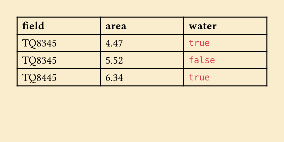

# tynding: Typst bindings for R


`tynding` is an R package that compiles Typst documents natively from R.

- it exposes a small API for <u>writing</u>, _evaluating_, and **compiling** Typst files
- it lets you specify:
  - output format (pdf, png, svg, html)
  - font path to search for font files
  - pdf standard (for accessibility)
  - root path for more complex repos
  - _any other kind of input_, for advanced templating
- basically zero performance overhead compared to the Typst command line!

<br>
<br>

## Installation

```r
install.packages("tynding", repos = c("https://y-sunflower.r-universe.dev"))
```

> [!NOTE]
> `tynding` uses Typst 0.14.2, and the plan is to keep it as close as possible to the latest upstream version.

<br>
<br>

## Quick start

You just need to specify the path to your Typst document to get started!

```r
library(tynding)

typst_compile("document.typ", output = "report.pdf")
```

<br>

## Features overview

- fonts: pass `font_path` to load font files from a directory before compiling.

```r
library(tynding)

markup <- c(
  '#set document(title: "custom font example")',
  '#set text(font: "Ultra")',
  '= hello world'
)

typ_file <- typst_write(markup)
pdf_file <- typst_compile(typ_file, font_path = "path/to/fonts")
```

<br>

- pdf standard: pass `pdf_standard` to request a Typst PDF profile such as `"1.7"`, `"2.0"`, `"a-2b"`, or `"ua-1"`.

```r
markup <- c(
  '#set document(title: "accessible PDF")',
  "= hello world"
)

typ_file <- typst_write(markup)
pdf_file <- typst_compile(typ_file, pdf_standard = "ua-1")
```

For `ua-1`, your document needs a title. Unsupported or invalid standards raise an error.

<br>

- output format: pass `output_format` to export as `"pdf"`, `"html"`, `"png"`, or `"svg"`. If you omit it, `tynding` will infer the format from the `output` extension when possible and otherwise default to PDF.

```r
library(tynding)

markup <- c(
  '#set document(title: "hello from tynding")',
  "= hello world",
  "this document was compiled from R."
)

typ_file <- typst_write(markup)
png_file <- typst_compile(typ_file, output_format = "png")
```

Multi-page `png` and `svg` exports will create multiple files. For this to [behave the same as the Typst CLI](https://typst.app/docs/reference/png/#exporting-as-png), you'll need to pass an output file name as a template string. For example:

```r
library(tynding)

markup <- c(
  "this document was compiled from R.",
  "#pagebreak()"
)

typ_file <- typst_write(markup)
png_file <- typst_compile(typ_file, output_format = "png", output = "output-{p}.png")
```

This will create `output-1.png` and `output-2.png`.

<br>

- `root`: by default, the root path corresponds to the parent directory of `file` (detected automatically), but you can use the `root` argument to specify a different path, which is often useful in more complex projects where, for example, font files are located in a parent directory.

```r
library(tynding)

typst_compile(
  "reports/typst/document.typ",
  root = "reports",
  font_path = "reports/fonts"
)
```

This will let you organize your project as follows, which isn't possible by default:

```
reports/
├── typst/
│   └── document.typ
└── fonts/
    ├── MyFont.tff
    └── MyFont-Bold.tff
```

Learn more in the [documentation website](https://y-sunflower.github.io/tynding/).

<br>

## Advanced usage with inputs

You can send inputs using Typst's `sys.inputs` handling. Basically, you do your thing with R, and then send whatever you want to Typst! For example:

```r
library(tynding)

typst_compile(
  "file.typ",
  title = "Quarterly report",
  # all additional arguments... can be anything you want!
  author = "Joseph",
  persons = list(
    list(name = "Joseph", age = 25),
    list(name = "Justine", age = 24),
    list(name = "Isaac", age = 2)
  )
)
```

Then your `file.typ` looks like this:

```typ
#set page(width: 10cm, height: 4cm, fill: rgb("#fca311"))

#let title = sys.inputs.at("title")
#let author = sys.inputs.at("author")
#let persons = json(bytes(sys.inputs.at("persons")))

= #title
*Author:* #author

#for person in persons [
  #strong(person.name) is #text(fill: red.darken(50%), weight: "bold", [#person.age]) years old. \
]
```


All extra arguments are accepted. Scalar values are passed as-is; other values are **JSON-encoded** (using `jsonlite::toJSON()`).

This means that we can, for instance, send a data frame from R to create a Typst table.

```r
df <- data.frame(
  field = c("TQ8345", "TQ8345", "TQ8445"),
  treated_area = c(4.47, 5.52, 6.34),
  water = c(TRUE, FALSE, TRUE)
)

typst_compile(
  "file.typ",
  data = df
)
```

The Typst file looks like:

```typ
#set page(width: 10cm, height: 15cm, fill: rgb("#faedcd"))

#let data = json(sys.inputs.at("data"))
#let keys = data.at(0).keys()
#let cols = (1fr,) + range(1, keys.len()).map(_ => 1fr)

#table(
  columns: cols,
  table.header(..keys.map(key=>[#text(weight: "bold", key)])),
  ..data
  .map(row => keys.map(key => [#row.at(key, default: "n/a")]))
  .flatten(),
)
```



<br>

## Error and warning messages

`tynding` gives you the same great error and warning messages that Typst gives you, which makes things easier to debug.

- Errors

For example, this will raise an error since `hello()` is undefined:

```typst
= Title of the report
Lorem ipsum...

#hello()
```

When you try to compile it:

```R
library(tynding)

typst_compile("document.typ")
```

```R
! error: unknown variable: hello
  ┌─ document.typ:3:2
  │
3 │ #hello
  │  ^^^^^
```

- Warnings

The same thing happens with warnings: Typst warnings raise R warnings.

```typst
#set text(font: "invalid font")

Hello world
```

When you try to compile:

```R
library(tynding)

typst_compile("document.typ")
```

```R
warning: unknown font family: invalid font
  ┌─ document.typ:1:17
  │
1 │ #set text(font: "invalid font")
  │                 ^^^^^^^^^^^^^^
```

<br>

## Related project

[`typr`](https://christophertkenny.com/typr/) is a package with a very similar goal, but it works quite differently under the hood. `typr` compiles your document using the Typst/Quarto CLI, while `tynding` uses the Typst compiler itself via the Typst Rust library.

Both have their pros and cons, but `tynding` is designed to be **faster** (no external command like `system2()` or `processx::run()`), **more portable** (don't worry about installing Typst separately and adding it to the PATH), and **more lightweight** (`jsonlite` as a single R dependency and no Rust runtime dependency).

`tynding` will also do other useful stuff such as R to Typst conversion, automatic encoding of objects that need it, and more!

<br>

## Coding with AI?

If you're coding with AI, this page is pretty much all it needs to know! Just copy everything above this section and send it to your favorite AI/LLM.
